Application intranet web de gestion pour la société [CAPA Intérim](https://www.capainterim.com/)

Récap

- Modèle MVC
- `PHP Symfony` pour la partie back-end
- Moteur de tamplate `Twig` et `React` pour la partie front-end

## Login page :


Page de connexion obligatoire pour accéder à tout le site

## Home page :


Page principal après la connexion qui regroupe tous les liens vers chaque autres page

## Agence liste page :

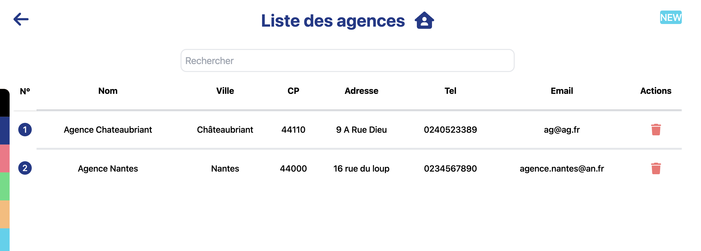

Liste de toutes les agences avec une bare de recherche

## Assurance liste page :

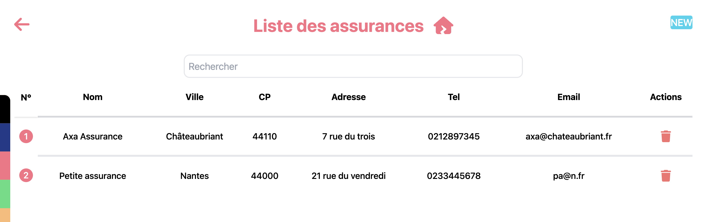

Liste de toutes les assurances avec une bare de recherche

## Personnel liste page :

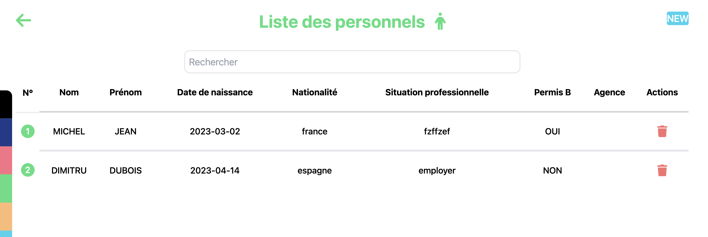

Liste de tous les personnels avec une bare de recherche

## Véhicule liste page :

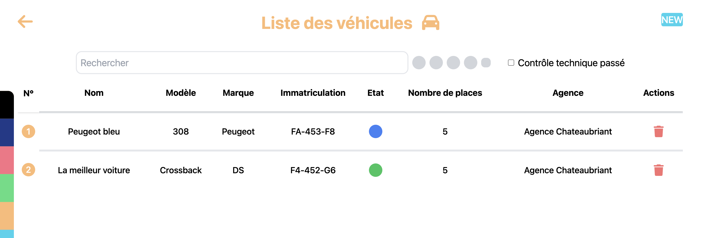

Liste de tous les véhicules avec une bare de recherche

## Logement liste page :

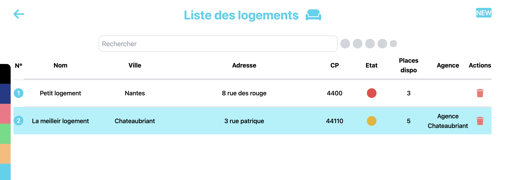

Liste de tous les logements avec une bare de recherche

## Entreprise liste page :

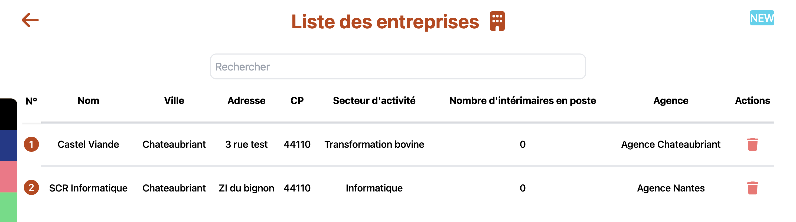

Liste de toutes les entreprises avec une bare de recherche

## Agence page :


Exemple de page d'une agence, on peux voir la liste de leurs contacts

## Entreprise page :

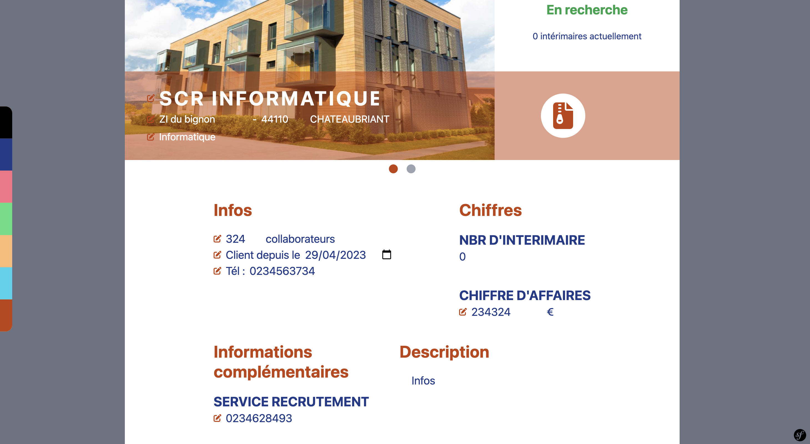

Exemple de page d'une entreprise

## Logement page :

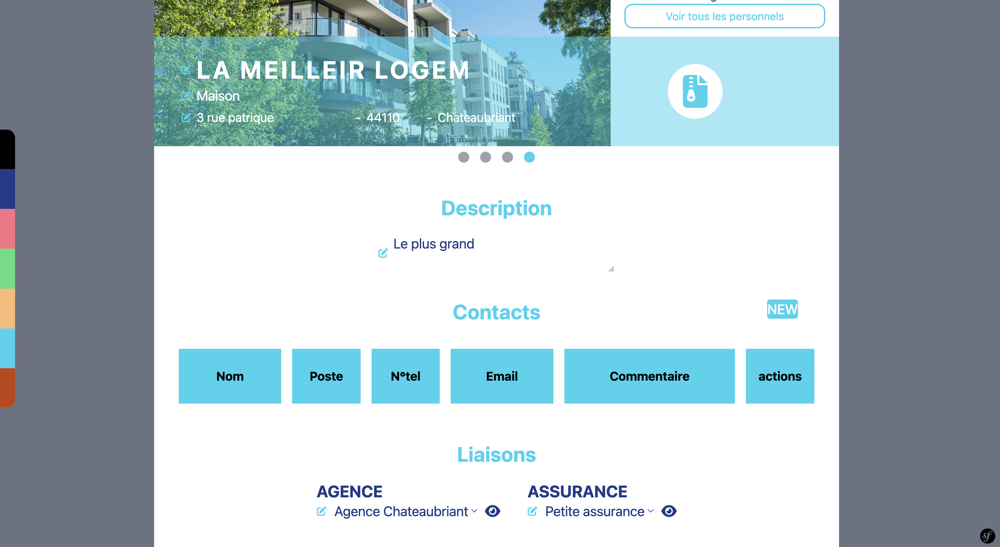

Exemple de page d'un logement, on peux voir la liste de leurs contacts et ses liaison avec son agence et son assurance

## Equipement liste page :

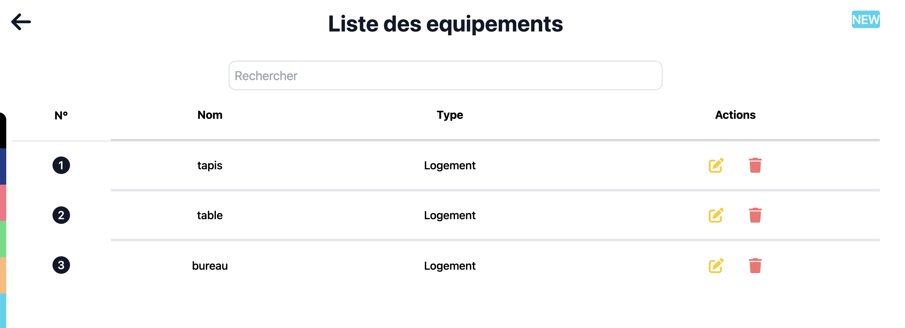

Liste de tous les équipements avec une bare de recherche

## Entretien liste page :

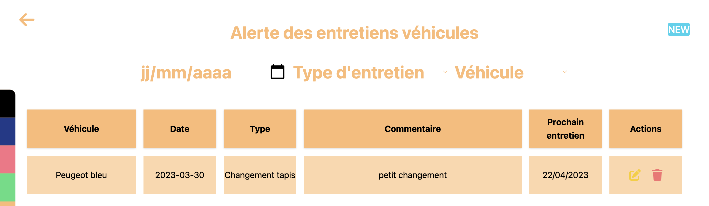

Liste de tous les entretiens véhicule avec un système de filtre sur la date, le type d'entretien et le véhicule

## Utilisateur formulaire page :

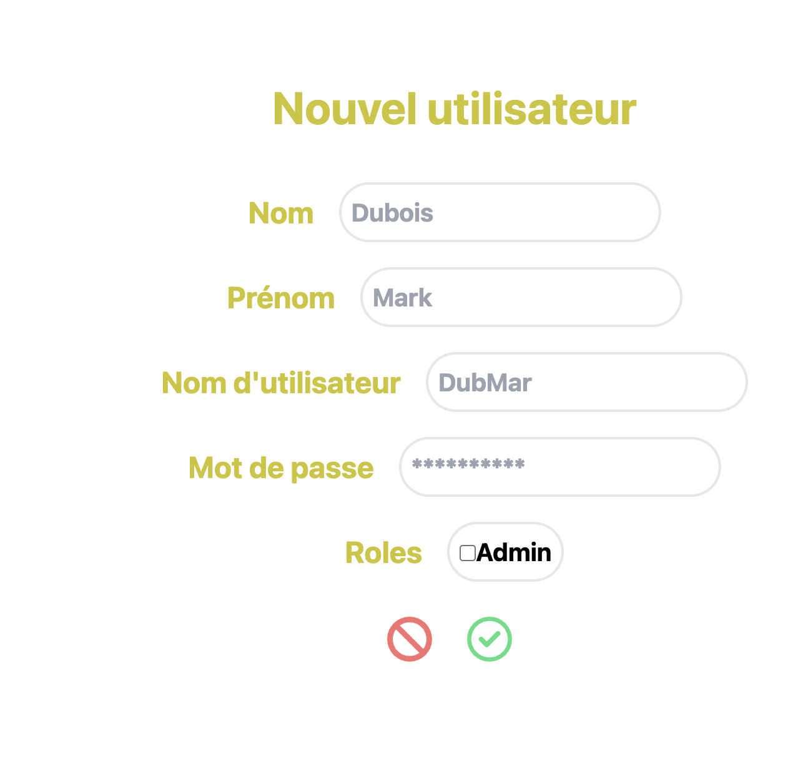

Page de formulaire d'ajout d'un nouvel utilisateur

## PHP Symfony ( exemple )

```php:title=PersonnelController.php
<?php

namespace App\Controller;

use App\Entity\Historique;
use App\Entity\Personnel;
use App\Form\PersonnelType;
use App\Repository\AgenceRepository;
use App\Repository\EntrepriseRepository;
use App\Repository\HistoriqueRepository;
use App\Repository\LogementRepository;
use App\Repository\PersonnelRepository;
use App\Repository\VehiculeRepository;
use DateTime;
use Sensio\Bundle\FrameworkExtraBundle\Configuration\IsGranted;
use Symfony\Bundle\FrameworkBundle\Controller\AbstractController;
use Symfony\Component\HttpFoundation\Request;
use Symfony\Component\HttpFoundation\Response;
use Symfony\Component\Routing\Annotation\Route;
use App\Service\JsonService;

#[Route('/personnel')]
// #[IsGranted('IS_AUTHENTICATED_FULLY')]
#[IsGranted('ROLE_USER')]
class PersonnelController extends AbstractController
{
    #[Route('/', name: 'app_personnel_index', methods: ['GET'])]
    public function index(PersonnelRepository $personnelRepository): Response
    {
        return $this->render('personnel/index.html.twig', [
            'personnels' => $personnelRepository->findAll(),
        ]);
    }

    #[Route('/new', name: 'app_personnel_new', methods: ['GET', 'POST'])]
    public function new(Request $request, PersonnelRepository $personnelRepository, HistoriqueRepository $historiqueRepository, JsonService $jsonService): Response
    {
        $personnel = new Personnel();
        $form = $this->createForm(PersonnelType::class, $personnel);
        $form->handleRequest($request);

        if ($form->isSubmitted() && $form->isValid()) {
            $personnelRepository->add($personnel, true);

            $json = $jsonService->jsonFormatter($personnel);

            $historique = new Historique();
            $historique->setApres($json);
            $historique->setType('new personnel');
            $historique->setUtilisateur($this->getUser());
            $historiqueRepository->add($historique, true);

            return $this->redirectToRoute('app_personnel_index', [], Response::HTTP_SEE_OTHER);
        }

        return $this->renderForm('personnel/new.html.twig', [
            'personnel' => $personnel,
            'form' => $form,
        ]);
    }

    #[Route('/{id}', name: 'app_personnel_show', methods: ['GET'])]
    public function show(Personnel $personnel, EntrepriseRepository $entrepriseRepository, AgenceRepository $agenceRepository, VehiculeRepository $vehiculeRepository, LogementRepository $logementRepository): Response
    {
        return $this->render('personnel/show.html.twig', [
            'personnel' => $personnel,
            'entreprises' => $entrepriseRepository->findAll(),
            'agences' => $agenceRepository->findAll(),
            'vehicules' => $vehiculeRepository->findAll(),
            'logements' => $logementRepository->findAll(),
            'isAdmin' => $this->isGranted('ROLE_ADMIN'),
        ]);
    }

    #[Route('/{id}/edit', name: 'app_personnel_edit', methods: ['GET', 'POST'])]
    public function test(Request $request, Personnel $personnel, PersonnelRepository $personnelRepository, EntrepriseRepository $entrepriseRepository, AgenceRepository $agenceRepository, VehiculeRepository $vehiculeRepository, LogementRepository $logementRepository, HistoriqueRepository $historiqueRepository, JsonService $jsonService): Response
    {
        $jsonAvant = $jsonService->jsonFormatter($personnel);

        $personnel->setNom($request->request->get('personnelNom'));
        $personnel->setPrenom($request->request->get('personnelPrenom'));
        $personnel->setSituationProfessionnelle($request->request->get('personnelSituationProfessionnelle'));
        $personnel->setNbEnfant((int) $request->request->get('personnelNbEnfant'));
        if($request->request->get('personnelDateDebutInterim') != null) {
            $personnel->setDateDebutInterim(new DateTime($request->request->get('personnelDateDebutInterim')));
        } else {
            $personnel->setDateDebutInterim(null);
        }
        $personnel->setTel($request->request->get('personnelTel'));
        if($request->request->get('personnelDateTitreSejour') != null) {
            $personnel->setDateTitreSejour(new DateTime($request->request->get('personnelDateTitreSejour')));
        } else {
            $personnel->setDateTitreSejour(null);
        }
        $personnel->setNSecuriteSociale($request->request->get('personnelNSecuriteSociale'));
        $personnel->setPermisB(filter_var($request->request->get('personnelPermisB'), FILTER_VALIDATE_BOOLEAN));
        $personnel->setNationnalite($request->request->get('personnelNationnalite'));
        $personnel->setDescription($request->request->get('personnelDescription'));
        $personnel->setEmail($request->request->get('personnelEmail'));
        if($request->request->get('personnelDateNaissance') != null) {
            $personnel->setDateNaissance(new DateTime($request->request->get('personnelDateNaissance')));
        } else {
            $personnel->setDateNaissance(null);
        }
        $personnel->setStatut($request->request->get('personnelStatut'));
        $personnel->setLieuNaissance($request->request->get('personnelLieuNaissance'));
        $personnel->setDiplome($request->request->get('personnelDiplome'));
        $personnel->setDiplome2($request->request->get('personnelDiplome2'));
        $personnel->setSecteur($request->request->get('personnelSecteur'));
        if($request->request->get('personnelDateRecyclageCaces') != null) {
            $personnel->setDateRecyclageCaces(new DateTime($request->request->get('personnelDateRecyclageCaces')));
        } else {
            $personnel->setDateRecyclageCaces(null);
        }
        $personnel->setEntreprise($entrepriseRepository->find($request->request->get('personnelEntrepriseId')));
        $personnel->setAgence($agenceRepository->find($request->request->get('personnelAgenceId')));
        $personnel->setVehicule($vehiculeRepository->find($request->request->get('personnelVehiculeId')));
        $personnel->setLogement($logementRepository->find($request->request->get('personnelLogementId')));
        $personnel->setConducteurPrincipal(filter_var($request->request->get('personnelConducteurPrincipal'), FILTER_VALIDATE_BOOLEAN));
        if($request->request->get('personnelDateDebutDernierEmploi') != null) {
            $personnel->setDateDebutDernierEmploi(new DateTime($request->request->get('personnelDateDebutDernierEmploi')));
        } else {
            $personnel->setDateDebutDernierEmploi(null);
        }

        $personnelRepository->add($personnel, true);

        $jsonApres = $jsonService->jsonFormatter($personnel);

        $historique = new Historique();
        $historique->setAvant($jsonAvant);
        $historique->setApres($jsonApres);
        $historique->setType('edit personnel');
        $historique->setUtilisateur($this->getUser());
        $historiqueRepository->add($historique, true);

        return $this->redirectToRoute('app_personnel_show', [
            'id' => $personnel->getId(),
        ]);
    }

    #[Route('/{id}/delete', name: 'app_personnel_delete', methods: ['GET', 'POST'])]
    public function delete(Request $request, Personnel $personnel, PersonnelRepository $personnelRepository, HistoriqueRepository $historiqueRepository, JsonService $jsonService): Response
    {
        // if ($this->isCsrfTokenValid('delete'.$personnel->getId(), $request->request->get('_token'))) {
        //     $personnelRepository->remove($personnel, true);
        // }
        $beforePersonnel = clone $personnel;

        $json = $jsonService->jsonFormatter($personnel);

        $personnelRepository->remove($personnel, true);

        $historique = new Historique();
        $historique->setAvant($json);
        $historique->setType('delete personnel');
        $historique->setUtilisateur($this->getUser());
        $historiqueRepository->add($historique, true);

        return $this->redirectToRoute('app_personnel_index', [], Response::HTTP_SEE_OTHER);
    }
}
```

## REACT

```jsx:title=personnelShowComponent.jsx
import React, { useState } from 'react';
import { FontAwesomeIcon } from '@fortawesome/react-fontawesome';
import { library } from "@fortawesome/fontawesome-svg-core";
import { faEdit, faEye, faFileArchive, faHistory, faLocationDot, faPenToSquare, faTrash } from "@fortawesome/free-solid-svg-icons";
import { faCircleCheck } from '@fortawesome/free-regular-svg-icons';

export default function personnelShow(props) {
    const [nWindow, setNWindow] = useState(0);
    const [isEdit, setIsEdit] = useState(false);

    function changeWindow(param) {
        setNWindow(param);
    }

    function goAgence(param) {
        if(param != null) {
            location.href = '/agence/' + param;
        }
    }

    function goNewContact(param) {
        location.href = param + '/contact/new';
    }

    function goNew(param) {
        location.href = 'new';
    }

    function goShow(param) {
        location.href = param;
    }

    function goEdit(param) {
        location.href = 'contact/' + param + '/edit';
    }

    function goDelete(param) {
        if(confirm('Voulez-vous vraiment supprimer ce contact ?') == true) {
            location.href = 'contact/' + param + '/delete';
        }
    }

    return (
        <div class="flex flex-col h-full bg-white">
            {/* <form method="post" action={props.personnel.id + '/edit'}> */}
            <iframe name="votar2" style={{display: 'none'}}></iframe>
            <form method="post" action={props.personnel.id + '/edit'} target='votar2'>

                <div class="flex flex-row h-96 relative">
                    <div class="flex flex-col bg-blue-200 bg-[url('/assets/images/personnel.jpeg')] bg-center bg-no-repeat bg-cover w-2/3"></div>
                    <div class="flex flex-col w-1/3">
                        <div class="flex flex-row justify-center gap-10 p-5">
                            <button className="btn" type='submit'><FontAwesomeIcon icon={faCircleCheck} className={isEdit ? 'flex text-4xl text-green-400 hover:cursor-pointer' : 'hidden text-4xl text-green-400 hover:cursor-pointer'} onClick={() => setIsEdit(false)}/></button>
                            <FontAwesomeIcon icon={faTrash} onClick={() => {if(confirm('Voulez-vous vraiment supprimer ce personnel ?')) {location.href=props.personnel.id + '/delete'}}} className="text-4xl text-red-400 hover:cursor-pointer" />
                            {
                                (() => {
                                    if(props.isAdmin) {
                                        return (
                                            <FontAwesomeIcon icon={faHistory} onClick={() => {location.href='/historique' + '?' + 'type=personnel' + '&' + 'id=' + props.personnel.id}} className="text-4xl text-equipement hover:cursor-pointer" />
                                        )
                                    }
                                })()
                            }
                        </div>
                        <div class="flex flex-row justify-center gap-10 p-5">
                            {
                                (() => {
                                    if(props.personnel.entrepriseId != null) {
                                        return (
                                            <div class="flex flex-col gap-5">
                                                <div className="flex flex-row">
                                                    <h2 class="text-2xl font-bold text-green-600">En poste</h2>
                                                </div>
                                                <div className="flex flex-col">
                                                    <div className="flex flex-row">
                                                        <p class="text-blue-900">{props.personnel.entrepriseNom}</p>
                                                    </div>
                                                    <div className="flex flex-row gap-2 items-center">
                                                        <FontAwesomeIcon icon={faEdit} className="text-sm text-green-400" />
                                                        <p class="text-blue-900">Depuis le</p>
                                                        <input className="text-blue-900 bg-inherit" type="date" name="personnelDateDebutDernierEmploi" id="personnelDateDebutDernierEmploi" defaultValue={props.personnel.dateDebutDernierEmploi} onChange={() => setIsEdit(true)} />
                                                    </div>
                                                </div>
                                            </div>
                                        )
                                    } else {
                                        return (
                                            <h2 class="text-2xl font-bold text-red-400">Pas de poste</h2>
                                        )
                                    }
                                })()
                            }
                        </div>
                    </div>

                    <div class="flex flex-row bg-green-400 bg-opacity-50 h-5/12 w-full bottom-0 absolute">
                        <div class="flex flex-col w-9/12 text-white px-10 justify-center gap-1">
                            {/* <h1>
                                <input className="text-4xl font-bold tracking-widest uppercase bg-inherit w-2/12" type="text" name="personnelNom" id="personnelNom" defaultValue={props.personnel.nom} placeholder="Dubois" onChange={() => setIsEdit(true)} />
                                <input className="text-4xl font-bold tracking-widest uppercase bg-inherit w-2/12" type="text" name="personnelPrenom" id="personnelPrenom" defaultValue={props.personnel.prenom} placeholder="Jean" onChange={() => setIsEdit(true)} />
                            </h1>
                            <p class="text-lg text-red-500">Adresse - <span class="uppercase">CP</span> <span class="uppercase">Ville</span></p>
                            <input className="bg-inherit w-2/12" type="text" name="personnelSituationProfessionnelle" id="personnelSituationProfessionnelle" defaultValue={props.personnel.situationProfessionnelle} placeholder="Agent de production" onChange={() => setIsEdit(true)} /> */}
                            <div className="flex flex-row gap-2 items-center">
                                <FontAwesomeIcon icon={faEdit} className="text-sm text-green-400" />
                                <h1><input className="text-4xl font-bold tracking-widest uppercase bg-inherit" type="text" name="personnelNom" id="personnelNom" defaultValue={props.personnel.nom} placeholder="Dubois" onChange={() => setIsEdit(true)} /></h1>
                            </div>
                            <div className="flex flex-row gap-2 items-center">
                                <FontAwesomeIcon icon={faEdit} className="text-sm text-green-400" />
                                <h1><input className="text-4xl font-bold tracking-widest uppercase bg-inherit" type="text" name="personnelPrenom" id="personnelPrenom" defaultValue={props.personnel.prenom} placeholder="Jean" onChange={() => setIsEdit(true)} /></h1>
                            </div>
                            {/* <div className="flex flex-row gap-2">
                                <p class="text-lg text-red-500">Adresse</p>
                                <p class="text-lg text-red-500">-</p>
                                <p class="text-lg text-red-500">Cp</p>
                                <p class="text-lg text-red-500">-</p>
                                <p class="text-lg text-red-500">Ville</p>
                            </div> */}
                            <div className="flex flex-row gap-2 items-center">
                                <FontAwesomeIcon icon={faEdit} className="text-sm text-green-400" />
                                <input className="bg-inherit w-80" type="text" name="personnelSituationProfessionnelle" id="personnelSituationProfessionnelle" defaultValue={props.personnel.situationProfessionnelle} placeholder="Agent de production" onChange={() => setIsEdit(true)} />
                            </div>
                        </div>
                        <div class="flex flex-col w-3/12 justify-center">
                            <div class="bg-white h-20 w-20 rounded-full cursor-pointer flex flex-row justify-center items-center" onClick={() => {location.href= '/ged/personnel/' + props.personnel.id}}>
                                <FontAwesomeIcon icon={faFileArchive} className="text-5xl text-personnel" />
                            </div>
                        </div>
                    </div>

                </div>

                <div className="flex flex-col h-auto gap-10">
                    {
                        (() => {
                            if(nWindow == 0) {
                                return (
                                    <div className="flex flex-row justify-center p-2 gap-4 z-10">
                                        <div className="h-4 w-4 bg-green-400 rounded-full hover:cursor-pointer" onClick={() => changeWindow(0)}></div>
                                        <div className="h-4 w-4 bg-gray-400 rounded-full hover:cursor-pointer" onClick={() => changeWindow(1)}></div>
                                    </div>
                                )
                            } else {
                                return (
                                    <div className="flex flex-row justify-center p-2 gap-4 z-10">
                                        <div className="h-4 w-4 bg-gray-400 rounded-full hover:cursor-pointer" onClick={() => changeWindow(0)}></div>
                                        <div className="h-4 w-4 bg-green-400 rounded-full hover:cursor-pointer" onClick={() => changeWindow(1)}></div>
                                    </div>
                                )
                            }
                        })()
                    }

                    <div className={`${(() => {if(nWindow == 0) {return 'flex'} else {return 'hidden'}})()} flex-col gap-10 z-10 text-xl`}>
                        <div className="flex flex-row px-32 justify-between gap-5"> {/* justify-center gap-96 */}

                            <div className="flex flex-col gap-5">
                                <div className="flex flex-row">
                                    <h2 className="text-3xl font-bold text-green-400">Infos</h2>
                                </div>
                                <div className="flex flex-col">
                                    <div className="flex flex-row gap-2 text-blue-900">
                                        {
                                            (() => {
                                                // const dateNaissance = new Date(Date.parse(props.personnel.dateNaissance));
                                                const dateNaissance = new Date(props.personnel.dateNaissance);
                                                var yearNaissance = dateNaissance.getFullYear();
                                                const dateNow = new Date();
                                                var yearNow = dateNow.getFullYear();
                                                return yearNow - yearNaissance;
                                            })()
                                        }
                                        <p>ans</p>
                                    </div>
                                    <div className="flex flex-row gap-2 items-center text-blue-900">
                                        <FontAwesomeIcon icon={faEdit} className="text-sm text-green-400" />
                                        <input className="bg-inherit w-10" type="number" name="personnelNbEnfant" id="personnelNbEnfant" defaultValue={props.personnel.nbEnfant} placeholder="2" onChange={() => setIsEdit(true)} />
                                        <p>enfants</p>
                                    </div>
                                    <div className="flex flex-row gap-2 items-center text-blue-900">
                                        <FontAwesomeIcon icon={faEdit} className="text-sm text-green-400" />
                                        <p>Intérim depuis le</p>
                                        <input className="bg-inherit" type="date" name="personnelDateDebutInterim" id="personnelDateDebutInterim" defaultValue={props.personnel.dateDebutInterim} onChange={() => setIsEdit(true)} />
                                    </div>
                                    <div className="flex flex-row gap-2 items-center text-blue-900">
                                        <FontAwesomeIcon icon={faEdit} className="text-sm text-green-400" />
                                        <p>Tél :</p>
                                        <input className="bg-inherit w-32" type="text" name="personnelTel" id="personnelTel" defaultValue={props.personnel.tel} placeholder="0214587896" onChange={() => setIsEdit(true)} />
                                    </div>
                                </div>
                            </div>

                            <div className="flex flex-col gap-5">
                                <div className="flex flex-row">
                                    <h2 className="text-3xl font-bold text-green-400">Chiffres</h2>
                                </div>
                                <div className="flex flex-col gap-10">
                                    <div className="flex flex-col">
                                        <div className="flex flex-row">
                                            <h3 className="text-2xl font-bold text-blue-900">TIRE DE SEJOUR</h3>
                                        </div>
                                        <div className="flex flex-row gap-2 items-center">
                                            <FontAwesomeIcon icon={faEdit} className="text-sm text-green-400" />
                                            <input className="text-blue-900 bg-inherit" type="date" name="personnelDateTitreSejour" id="personnelDateTitreSejour" defaultValue={props.personnel.dateTitreSejour} onChange={() => setIsEdit(true)} />
                                        </div>
                                    </div>
                                    <div className="flex flex-col">
                                        <div className="flex flex-row">
                                            <h3 className="text-2xl font-bold text-blue-900">N° SECURITE SOCIALE</h3>
                                        </div>
                                        <div className="flex flex-row gap-2 items-center">
                                            <FontAwesomeIcon icon={faEdit} className="text-sm text-green-400" />
                                            <input className="text-blue-900 bg-inherit" type="text" name="personnelNSecuriteSociale" id="personnelNSecuriteSociale" defaultValue={props.personnel.nSecuriteSociale} placeholder="010506zefzf" onChange={() => setIsEdit(true)} />
                                        </div>
                                    </div>
                                </div>
                            </div>

                        </div>

                        <div className="flex flex-row px-32 justify-between gap-5"> {/* justify-center gap-96 */}

                            <div className="flex flex-col gap-5">
                                <div className="flex flex-row">
                                    <h2 className="text-3xl font-bold text-green-400">Infos complémentaires</h2>
                                </div>
                                <div className="flex flex-col gap-10">
                                    <div className="flex flex-col">
                                        <div className="flex flex-row">
                                            <h3 className="text-2xl font-bold text-blue-900">PERMIS B</h3>
                                        </div>
                                        <div className="flex flex-row gap-2 items-center">
                                            <FontAwesomeIcon icon={faEdit} className="text-sm text-green-400" />
                                            {
                                                (() => {
                                                    if(props.personnel.permisB == true) {
                                                        return (
                                                            <select className='text-blue-900 w-20' name="personnelPermisB" id="personnelPermisB" defaultValue={true} onChange={() => setIsEdit(true)}>
                                                                <option value={true}>OUI</option>
                                                                <option value={false}>NON</option>
                                                            </select>
                                                        )
                                                    } else {
                                                        return (
                                                            <select className='text-blue-900 w-20' name="personnelPermisB" id="personnelPermisB" defaultValue={false} onChange={() => setIsEdit(true)}>
                                                                <option value={true}>OUI</option>
                                                                <option value={false}>NON</option>
                                                            </select>
                                                        )
                                                    }
                                                })()
                                            }
                                        </div>
                                    </div>
                                    <div className="flex flex-col">
                                        <div className="flex flex-row">
                                            <h3 className="text-2xl font-bold text-blue-900">NATIONALITE</h3>
                                        </div>
                                        <div className="flex flex-row gap-2 items-center">
                                            <FontAwesomeIcon icon={faEdit} className="text-sm text-green-400" />
                                            <input className="text-blue-900 bg-inherit" type="text" name="personnelNationnalite" id="personnelNationnalite" defaultValue={props.personnel.nationnalite} placeholder="France" onChange={() => setIsEdit(true)} />
                                        </div>
                                    </div>
                                </div>
                            </div>

                            <div className="flex flex-col gap-5">
                                <div className="flex flex-row">
                                    <h2 className="text-3xl font-bold text-green-400">Description</h2>
                                </div>
                                <div className="flex flex-row gap-2 items-center">
                                    <FontAwesomeIcon icon={faEdit} className="text-sm text-green-400" />
                                    <textarea className="text-blue-900 bg-inherit" type="text" name="personnelDescription" id="personnelDescription" cols="30" rows="10" placeholder="Description du personnel" onChange={() => setIsEdit(true)}>{props.personnel.description}</textarea>
                                </div>
                            </div>

                        </div>
                    </div>

                    <div className={`${(() => {if(nWindow == 1) {return 'flex'} else {return 'hidden'}})()} flex-col gap-10 z-10 mb-10 text-xl`}>

                        <div className="flex flex-row px-32 justify-center gap-5">

                            <div className="flex flex-col gap-5">
                                <h2 className="text-3xl font-bold text-green-400 text-center">Détails</h2>
                                <div className="flex flex-col gap-10">
                                    <div className="grid grid-cols-2 gap-y-16 gap-x-16">
                                        <div className="flex flex-col">
                                            <div className="flex flex-row">
                                                <h3 className="text-2xl font-bold text-blue-900">ADRESSE MAIL</h3>
                                            </div>
                                            <div className="flex flex-row gap-2 items-center">
                                                <FontAwesomeIcon icon={faEdit} className="text-sm text-green-400" />
                                                <input className="text-blue-900 bg-inherit" type="text" name="personnelEmail" id="personnelEmail" defaultValue={props.personnel.email} placeholder="test@gmail.com" onChange={() => setIsEdit(true)} />
                                            </div>
                                        </div>
                                        <div className="flex flex-col">
                                            <div className="flex flex-row">
                                                <h3 className="text-2xl font-bold text-blue-900">DATE DE NAISSANCE</h3>
                                            </div>
                                            <div className="flex flex-row gap-2 items-center">
                                                <FontAwesomeIcon icon={faEdit} className="text-sm text-green-400" />
                                                <input className="text-blue-900 bg-inherit" type="date" name="personnelDateNaissance" id="personnelDateNaissance" defaultValue={props.personnel.dateNaissance} onChange={() => setIsEdit(true)} />
                                            </div>
                                        </div>
                                        <div className="flex flex-col">
                                            <div className="flex flex-row">
                                                <h3 className="text-2xl font-bold text-blue-900">STATUT</h3>
                                            </div>
                                            <div className="flex flex-row gap-2 items-center">
                                                <FontAwesomeIcon icon={faEdit} className="text-sm text-green-400" />
                                                <input className="text-blue-900 bg-inherit" type="text" name="personnelStatut" id="personnelStatut" defaultValue={props.personnel.statut} placeholder="Employe non cadre" onChange={() => setIsEdit(true)} />
                                            </div>
                                        </div>
                                        <div className="flex flex-col">
                                            <div className="flex flex-row">
                                                <h3 className="text-2xl font-bold text-blue-900">LIEU DE NAISSANCE</h3>
                                            </div>
                                            <div className="flex flex-row gap-2 items-center">
                                                <FontAwesomeIcon icon={faEdit} className="text-sm text-green-400" />
                                                <input className="text-blue-900 bg-inherit" type="text" name="personnelLieuNaissance" id="personnelLieuNaissance" defaultValue={props.personnel.lieuNaissance} placeholder="Paris" onChange={() => setIsEdit(true)} />
                                            </div>
                                        </div>
                                        <div className="flex flex-col">
                                            <div className="flex flex-row">
                                                <h3 className="text-2xl font-bold text-blue-900">DIPLOME</h3>
                                            </div>
                                            <div className="flex flex-row gap-2 items-center">
                                                <FontAwesomeIcon icon={faEdit} className="text-sm text-green-400" />
                                                <input className="text-blue-900 bg-inherit" type="text" name="personnelDiplome" id="personnelDiplome" defaultValue={props.personnel.diplome} placeholder="bac" onChange={() => setIsEdit(true)} />
                                            </div>
                                        </div>
                                        <div className="flex flex-col">
                                            <div className="flex flex-row">
                                                <h3 className="text-2xl font-bold text-blue-900">DIPLOME 2</h3>
                                            </div>
                                            <div className="flex flex-row gap-2 items-center">
                                                <FontAwesomeIcon icon={faEdit} className="text-sm text-green-400" />
                                                <input className="text-blue-900 bg-inherit" type="text" name="personnelDiplome2" id="personnelDiplome2" defaultValue={props.personnel.diplome2} placeholder="cariste" onChange={() => setIsEdit(true)} />
                                            </div>
                                        </div>
                                        <div className="flex flex-col">
                                            <div className="flex flex-row">
                                                <h3 className="text-2xl font-bold text-blue-900">SECTEUR</h3>
                                            </div>
                                            <div className="flex flex-row gap-2 items-center">
                                                <FontAwesomeIcon icon={faEdit} className="text-sm text-green-400" />
                                                <input className="text-blue-900 bg-inherit" type="text" name="personnelSecteur" id="personnelSecteur" defaultValue={props.personnel.secteur} placeholder="chateaubriant" onChange={() => setIsEdit(true)} />
                                            </div>
                                        </div>
                                        <div className="flex flex-col">
                                            <div className="flex flex-row">
                                                <h3 className="text-2xl font-bold text-blue-900">RECYCLAGE CACES</h3>
                                            </div>
                                            <div className="flex flex-row gap-2 items-center">
                                                <FontAwesomeIcon icon={faEdit} className="text-sm text-green-400" />
                                                <input className="text-blue-900 bg-inherit" type="date" name="personnelDateRecyclageCaces" id="personnelDateRecyclageCaces" defaultValue={props.personnel.dateRecyclageCaces} onChange={() => setIsEdit(true)} />
                                            </div>
                                        </div>
                                    </div>
                                </div>
                            </div>

                        </div>

                        <div className="flex flex-row px-32 justify-center gap-5">

                            <div className="flex flex-col gap-5">
                                <h2 className="text-3xl font-bold text-green-400 text-center">Liaisons</h2>
                                <div className="flex flex-row flex-wrap justify-center gap-10">

                                    <div className="flex flex-col">
                                        <div className="flex flex-row">
                                            <h3 className="text-2xl font-bold text-blue-900">AGENCE</h3>
                                        </div>
                                        <div className="flex flex-row gap-2 items-center">
                                            <FontAwesomeIcon icon={faEdit} className="text-sm text-green-400" />
                                            <select className='text-blue-900' name="personnelAgenceId" id="personnelAgenceId" defaultValue={props.personnel.agenceId} onChange={() => setIsEdit(true)}>
                                                <option value={null}>Aucune</option>
                                                {
                                                    props.agences.map((agence) => {
                                                        return <option value={agence.id}>{agence.nom}</option>
                                                    })
                                                }
                                            </select>
                                            {
                                                (() => {
                                                    if(props.personnel.agenceId != null) {
                                                        return <FontAwesomeIcon icon={faEye} className="text-xl text-blue-900 hover:cursor-pointer" onClick={() => location.href='/agence/' + props.personnel.agenceId} />
                                                    }
                                                })()
                                            }
                                        </div>
                                    </div>

                                    <div className="flex flex-col">
                                        <div className="flex flex-row">
                                            <h3 className="text-2xl font-bold text-blue-900">ENTREPRISE</h3>
                                        </div>
                                        <div className="flex flex-row gap-2 items-center">
                                            <FontAwesomeIcon icon={faEdit} className="text-sm text-green-400" />
                                            <select className='text-blue-900' name="personnelEntrepriseId" id="personnelEntrepriseId" defaultValue={props.personnel.entrepriseId} onChange={() => setIsEdit(true)}>
                                                <option value={null}>Aucune</option>
                                                {
                                                    props.entreprises.map((entreprise) => {
                                                        return <option value={entreprise.id}>{entreprise.nom}</option>
                                                    })
                                                }
                                            </select>
                                            {
                                                (() => {
                                                    if(props.personnel.entrepriseId != null) {
                                                        return <FontAwesomeIcon icon={faEye} className="text-xl text-blue-900 hover:cursor-pointer" onClick={() => location.href='/entreprise/' + props.personnel.entrepriseId} />
                                                    }
                                                })()
                                            }
                                        </div>
                                    </div>

                                    <div className="flex flex-col">
                                        <div className="flex flex-row">
                                            <h3 className="text-2xl font-bold text-blue-900">VEHICULE</h3>
                                        </div>
                                        <div className="flex flex-row gap-2 items-center">
                                            <FontAwesomeIcon icon={faEdit} className="text-sm text-green-400" />
                                            <select className='text-blue-900' name="personnelVehiculeId" id="personnelVehiculeId" defaultValue={props.personnel.vehiculeId} onChange={() => setIsEdit(true)}>
                                                <option value={null}>Aucun</option>
                                                {
                                                    props.vehicules.map((vehicule) => {
                                                        return <option value={vehicule.id}>{vehicule.nom}</option>
                                                    })
                                                }
                                            </select>
                                            {
                                                (() => {
                                                    if(props.personnel.vehiculeId != null) {
                                                        return <FontAwesomeIcon icon={faEye} className="text-xl text-blue-900 hover:cursor-pointer" onClick={() => location.href='/vehicule/' + props.personnel.vehiculeId} />
                                                    }
                                                })()
                                            }
                                        </div>
                                        <div className="flex flex-row gap-2 items-center">
                                            <FontAwesomeIcon icon={faEdit} className="text-sm text-green-400" />
                                            {
                                                (() => {
                                                    if(props.personnel.conducteurPrincipal == true) {
                                                        return (
                                                            <div className="flex flex-row text-blue-900">
                                                                <p>Conducteur principal</p>
                                                                <select name="personnelConducteurPrincipal" id="personnelConducteurPrincipal" defaultValue={true} onChange={() => setIsEdit(true)}>
                                                                    <option value={true}>OUI</option>
                                                                    <option value={false}>NON</option>
                                                                </select>
                                                            </div>
                                                        )
                                                    } else {
                                                        return (
                                                            <div className="flex flex-row text-blue-900">
                                                                <p>Conducteur principal</p>
                                                                <select name="personnelConducteurPrincipal" id="personnelConducteurPrincipal" defaultValue={false} onChange={() => setIsEdit(true)}>
                                                                    <option value={true}>OUI</option>
                                                                    <option value={false}>NON</option>
                                                                </select>
                                                            </div>
                                                        )
                                                    }
                                                })()
                                            }
                                        </div>
                                    </div>

                                    <div className="flex flex-col">
                                        <div className="flex flex-row">
                                            <h3 className="text-2xl font-bold text-blue-900">LOGEMENT</h3>
                                        </div>
                                        <div className="flex flex-row gap-2 items-center">
                                            <FontAwesomeIcon icon={faEdit} className="text-sm text-green-400" />
                                            <select className='text-blue-900' name="personnelLogementId" id="personnelLogementId" defaultValue={props.personnel.logementId} onChange={() => setIsEdit(true)}>
                                                <option value={null}>Aucun</option>
                                                {
                                                    props.logements.map((logement) => {
                                                        return <option value={logement.id}>{logement.nom}</option>
                                                    })
                                                }
                                            </select>
                                            {
                                                (() => {
                                                    if(props.personnel.logementId != null) {
                                                        return <FontAwesomeIcon icon={faEye} className="text-xl text-blue-900 hover:cursor-pointer" onClick={() => location.href='/logement/' + props.personnel.logementId} />
                                                    }
                                                })()
                                            }
                                        </div>
                                    </div>

                                </div>
                            </div>

                        </div>

                    </div>

                </div>
            </form>
        </div>
    );
}
```

## Resources

- <https://symfony.com//>
- <https://fr.legacy.reactjs.org//>
