# Introduction

I think it's imperative that everone working with data understand transactions.

In this post i'll explain what is a transaction is ? the 4 ACID key propetrties, we'll also discover different types and strategies of a transaction.

I'll dive deeper into the declarative and programatic trancs management and the patterns/paradigms spring uses behind the scenes to implement them.

Spring transaction management features is one of the most widely used features of Spring framework, so what are pros and when to opt for programmatic management over declarative management and vice versa.

It started when i realized that a `@Transactional` annotation is not functioning on a project i was contributing to, it was because of a bad configuration of spring which can't intercept methods and add the transaction behavior to them.

What i learned from this is:

> Don't overtrust others configuration, always try things your own and make sure it works.

# What is a transaction ?

Transaction is a series of actions that fail as a group or complete entirely as a group, all these actions should be rollback in case of any failure, but if all of them complete then the transaction should be permanently comitted.

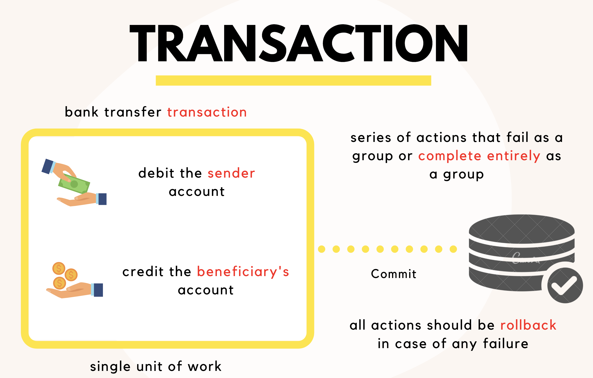

I'm simulating a case of money transfer from an account to another, later we'll see the implementation of the MoneyTransfer Spring Boot application, but for now, in our example the transaction code should be something like that.

```java:title=MoneyTransferTransaction

		try {
			conn = dataSource.getConnection();
			conn.setAutoCommit(false);

			// highlight-start
			withdraw(fromAccount, amount, fee);
			deposit(toAccount, amount);
      // highlight-end

			conn.commit();
		} catch (SQLException e) {
			...
			conn.rollback();
			...
		}
	}
```

---

# Transaction types

Depending on the enviroment where you're managing the transaction, there are two types of transactions:

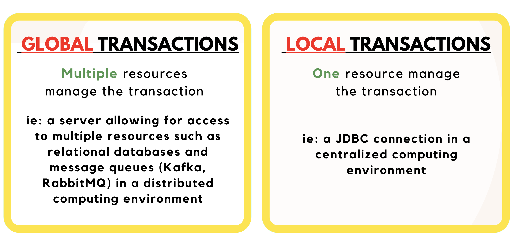

### 1. Global transaction

They're used when multiple resources manage trx, can span multiple transactional resources i.e an application server allowing for access to many relational databases and message queues.

Global transaction management is required in a distributed computing environment where all the resources are distributed across multiple systems. In such a case, transaction management needs to be done both at local and global levels. A distributed or a global transaction is executed across multiple systems, and its execution requires coordination between the global transaction management system and all the local data managers of all the involved systems.

### 2. Local transaction

Local transaction management can be useful in a centralized computing environment where application components and resources are located at a single site, and transaction management only involves a local data manager running on a single machine. Local transactions are easier to be implemented that's why they's our case in the TransferMoney Spring Boot application.

---

# 4 Key ACID properties

All transactions processing systems must implement:

- Failure recovery (Atomicity, Durability).
- Concurrency control (Isolation, Consistency).

The ACID properties, in totality, provide a mechanism to ensure correctness and consistency of a database in a way such that each transaction is a group of operations that acts a single unit, produces consistent results, acts in isolation from other operations and updates that it makes are durably stored.

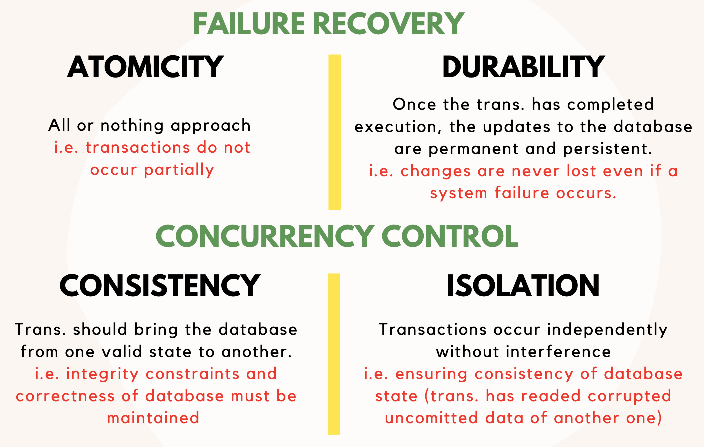

### > Atomicity

By this, we mean that either the entire transaction takes place at once or doesn’t happen at all. There is no midway i.e. transactions do not occur partially.
Each transaction is considered as one unit and either runs to completion or is not executed at all.

### > Consistency

This means that integrity constraints must be maintained so that the database is consistent before and after the transaction.
It refers to the correctness of a database.

Referring to the example above, let's say that we have a rule or a bank supervision standard that limits the daily transactions to 500000, so we'll surely have a database check constraint for this.

This rule must be maintained before and after the transaction, let's suppose this is a method that enable a money tranfer

```java
//Signature
private void transferMoney(fromAccount, toAccount, amount, currency);
//The call
this.transferMoney(fromAccount, toAccount, 500000, 'MAD');
```

500000 >>> 1000, therefore, database is inconsistent.

Another example to showcase the consistency is: **_Money Tranfer of 100 from Hamza to Zakarya_** .

Before the transaction:

**Hamza's account balance**: 200.

**Zakarya's account balance**: 200.

=> **Total**: **_400_**.

After the transaction:

**Hamza's account balance**: 100.

**Zakarya's account balance**: 300.

=> **Total**: **_400_**.

the total amount must remain the same.

```java
total = fromAccount.getBalance() + toAccount.getBalance();
```

### > Isolation

This property ensures that multiple transactions can occur concurrently without leading to the inconsistency of database state.

Transactions occur independently without interference. Changes occurring in a particular transaction will not be visible to any other transaction until that particular change in that transaction is written to memory or has been committed.

Isolation mailnly help avoid those kind of problems:

-     Dirty reads
-     Non-repeatable reads
-     Phantom reads (lecture fontôme)

Read more about that [here](<https://en.wikipedia.org/wiki/Isolation_(database_systems)#Read_phenomena>).

### > Durability

This property ensures that once the transaction has completed execution, the updates and modifications to the database are stored in and written to disk and they persist even if a system failure occurs.
These updates now become permanent and are stored in non-volatile memory, so the effects of the transaction, thus, are never lost.

---

# Why using Spring Framework for transaction management ?

When it comes to trans, spring provides a lot of advantages:

- Providing a consistent programming model across global and local transactions (by setting a uniform API across all different transaction & persistence APIs.)
- lightweight and flexible trans. management.
- Support for both programmatic & declarative trans. management.
- Extra support of springboot to transaction management.
- Benefits from different trans. management strategies.

if this looks too complicated to you don't be discouraged, we'll explain this thourghly.

What i mean by a **_consistent programming model_** is that Spring set a uniform API across all different transaction & persistence APIs, because obviously there is several different APIs involved on manage trans such as:

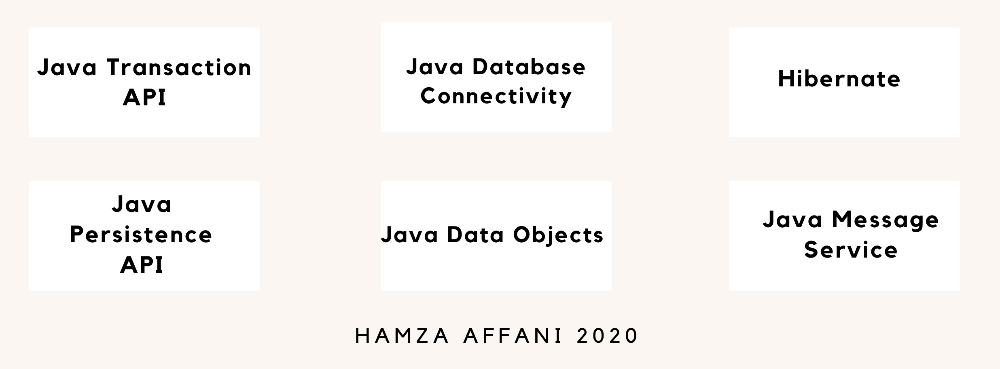

Now, Imagine that you're using EclipseLink as your persistence provider, and you want to migrate to Hibernate,
without spring you'd have to make code changes because they have different implementations for trans. management, but
using Spring, there is no code changes are required, and you're using a simpler uniformAPi than any complex API.

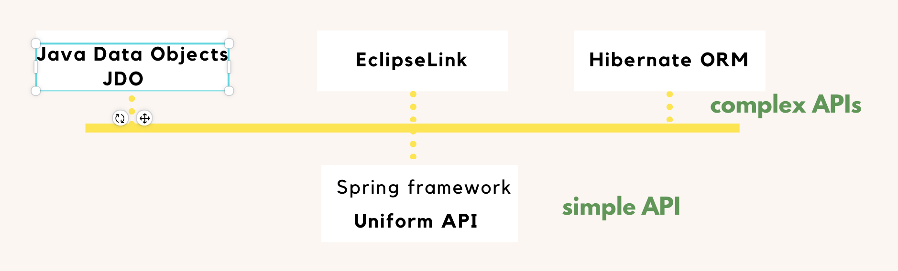

# Isolation levels

Remember Isolation from ACID properties, Spring supports isolation levels that help developers avoid problems that may arise when multiple transactions in the application are operating concurrently on the same data (concurrency control).

those isolation levels are:

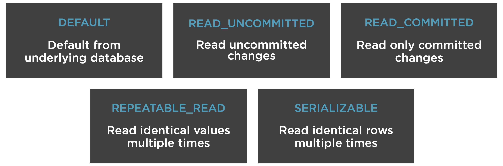

# Transaction management types

Transaction management ensures data consistency and integrity,

As i mentioned before, spring supports both programmatic & declarative trans. management, and these are the two ways you handle and manage transactions:

#### > Declarative transaction management:

An approach that allows the developer separates transaction management from business code, you start by setting your configuration XML based that uses XML files outside of the code or via Java annotations.

- Manage transactions via configuration.
- Separate transaction logic from business logic.
- Easy to maintain.
- Preferred when a lot of transaction logic.

#### > Programmatic transaction management:

There is where developer writes custom code to manage the transaction and set boundaries.

- Explicitly coded transaction management.
- Manage transactions via code.
- Useful for minimal transaction logic.
- Flexible but difficult to maintain.
- Couples transaction and business logic.

#### > When to use declarative transaction management over programmatic trx management and vice versa ?

It depends on your needs, personally i'm using the annotation config and i handle my transactions the declarative way in 90% of cases, however when sometimes you need more control to your transaction, you need to decide when exactly commit your changes or whatever, spring provide you support for this too, so you can be more flexible with your transaction, what you should know is in that case you'll have to couple trans. technical code and your business logic; this make things harder to maintain

---

# TransferMoney Spring Boot application

I believe practise is the key to mastery, so i made this spring boot application that helps us simulate transfering money from account A to account B as a transaction.

Clone it from my github repository by clicking [this link](https://github.com/haffani/spring-transaction-management).

#### > Prerequisites

Java 1.8 +, IDE (Eclipse, IntellejIDEA), Maven 3.0 +, Git, Postman.

#### > Architecture

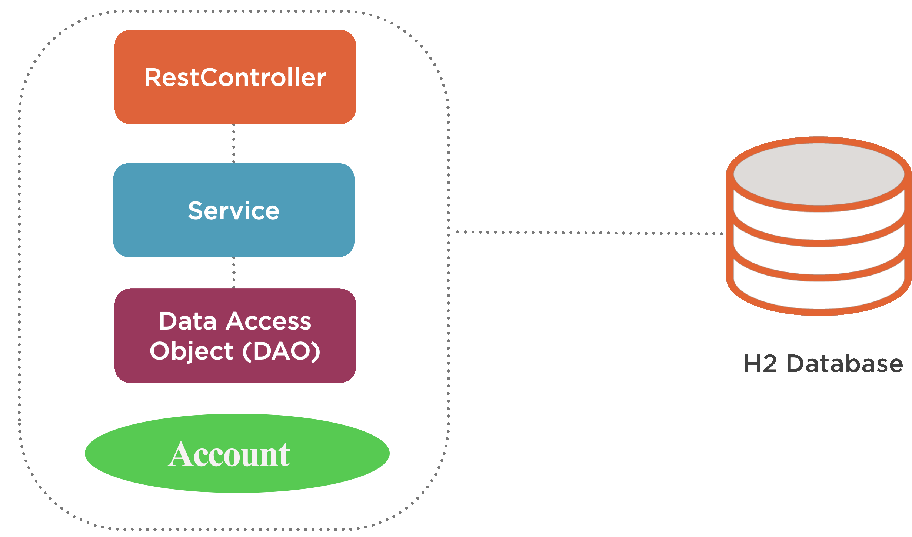

#### > H2 database configuration

On resources we have added this file to populate data.

In the demo, we'll see how the money transfer effects on the database later on

```SQL:title=data.sql
INSERT INTO account (id, acct_number, balance, name, rate)
VALUES (1, 11111, 200,  'Hamza AFFANI', 0.035);

INSERT INTO account (id, acct_number, balance, name, rate)
VALUES (2, 22222, 200,  'Zakarya AFFANI', 0.035);
```

```java:title=WebConfiguration.java
@Configuration
public class WebConfiguration {
    @Bean
    ServletRegistrationBean h2servletRegistration(){
      // highlight-next-line
        ServletRegistrationBean registrationBean = new ServletRegistrationBean( new WebServlet());
        registrationBean.addUrlMappings("/console/*");
        return registrationBean;
    }
}
```

---

# Implementing declarative transaction management

before starting the implemntation, let's list what spring does behind the scenes of your declarative trx management

> => Aspect Oriented Programming (AOP) paradigm & Proxy pattern

AOP is a programming paradigm that breaks programing logic into distinct parts, Spring uses this paradigm when implementing trx management which is enabled via proxies,

so when you're not using a proxy, here is what we have at runtime:

### Without proxy

The method is invoked directly on that object reference
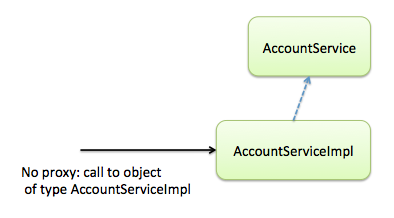

### With proxy

When a proxy is used and you invoke a method transferMoney on an object reference, the method is no longer invoked directly on that object reference, but instead on a reference to the proxy.

At startup time, a new class is created, called proxy. This one is in charge of adding Transactional behavior as follows:

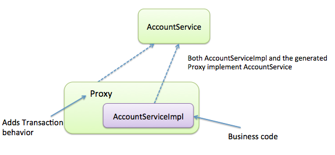

The generated proxy class comes on top of AccountServiceImpl. It adds Transactional behavior to it.

So how to make sure that a proxy is indeed being used? For your own understanding, it’s interesting to go back into the code and see with your very eyes that you are indeed using a proxy.

A simple way is to print out the class name:

```java:title=java
AccountService accountService = (AccountService) applicationContext.getBean(AccountService.class);
String accountServiceClassName = accountService.getClass().getName();
logger.info(accountServiceClassName);
```

it should show an output similar to this:

    INFO : transaction.TransactionProxyTest - $Proxy13

This class is a dynamic Proxy, generated by Spring using the JDK Reflection API.

At shutdown (eg. When the application is stopped), the proxy class will be destroyed and you will only have AccountService and AccountServiceImpl on the file system:

---

> The default advice mode for processing `@Transactional` annotations is proxy.

To summarize proxy uses

- `Transaction interceptor` which intercepts method calls.
- `Platform transaction manager` that handles transactions.

At a high level, Spring creates proxies for all the classes annotated with @Transactional – either on the class or on any of the methods. The proxy allows the framework to inject transactional logic before and after the running method – mainly for starting and committing the transaction.

4 Components interacting with each other are used by spring to handle your trans.:

- **_`Persistence context proxy`_**

Cuz the entities live in database are managed by entity manager, it defines methods that are used to interact with persistence context.

- **_`Entity manager proxy`_**

database trans. happens inside the scope of a persistence context which is a set of managed entity instances that exist in a particular store (H2 in our case), it defines the scope for entity instances. (each enity manager is associated to a persistence context).

- **_`Transaction aspect`_**

intercept method calls with the annotation Transactional, what i should mention here is the interceptor is called before and after the method is invoked on the object reference (first call before to begin a transaction & second call after to commit changes), it has two main responsabilities, first determines if new trans needed, the other is determines decides when to commit, rollback or left running.

- **_`Transaction manager`_**

it's an abstraction abstraction, represented in our case by Spring's [platform transcation manager](https://docs.spring.io/spring-framework/docs/current/javadoc-api/org/springframework/transaction/PlatformTransactionManager.html) interface, we are using actually the JPA transaction manager that provide essential methods for controlling trans operations at runtime like begin, commit, rollback.

> Spring recommends that you only annotate concrete classes.

### Transaction settings

```java:title=Propagation
@Transactional ( propagation = Propagation.REQUIRED )
//Code will always run in a transaction

@Transactional ( propagation = Propagation.REQUIRES_NEW )
//Code will always run in a new transaction

@Transactional ( propagation = Propagation.NEVER )
//Method shouldn’t be run within a transaction
```

```java:title=Isolation
@Transactional(isolation = Isolation.READ_UNCOMMITTED)
//Allows dirty reads
@Transactional(isolation = Isolation.READ_COMMITTED)
//Does not allow dirty reads
@Transactional(isolation = Isolation.REPEATABLE_READ)
//Result always the same if row read twice
@Transactional(isolation = Isolation.SERIALIZABLE)
//Performs all transactions in a sequence
```

```java:title=Timeout
@Transactional( timeout=5 )
//Timeout for the operation wrapped by the transaction
```

```java:title=ReadOnly
@Transactional( read-only = true )
/**
=> Transactions don’t write back to database
=> Optimizes data access
=> Provides a hint to the persistence provider
=> Only relevant inside a transaction
*/
```

Now here is an implementation of a delarative transaction management.

```java:title=DeclarativeTrxAccountService.java
/**
 * @author Hamza AFFANI
 * @version 1.0
 *          Declarative transaction management implementation
 */

@Service
 // highlight-next-line
@Transactional
@Qualifier("declarativeTrxManagementBean")
public class DeclarativeTrxAccountService implements IAccountService {

	private final NumberFormat fmt = NumberFormat.getCurrencyInstance();

	@Autowired
	private IAccountDAO accountDAO;

	@Override
	public List<Account> getAllAccounts() {
		return accountDAO.findAll();
	}

	@Override
	public void addAccount(Account account) {
		accountDAO.save(account);
	}

	@Override
	public Optional<Account> getAccount(int accountId) {
		return accountDAO.findById((long) accountId);
	}

 // highlight-start
	@Override
	public void transferMoney(Account from, Account to, double amount, double fee) {
		/**
		 * Transaction consists of two steps:
     * 1.) withdraw from the sender account an amount and set debited as last_operation
		 * 2.) deposit the same amount to the beneficiary's account and set credited as last_operation
		 */
	  withdraw(from, amount, fee);
		deposit(to, amount);
	}
   // highlight-end

	/**
	 * Deposits the specified amount into the account.
	 */
	private void deposit(Account to, double amount) {
		Account accountToCredit = getAccount(to.getId().intValue()).get();
      ...
			accountToCredit.setBalance(accountToCredit.getBalance() + amount);
			accountToCredit.setLast_operation("Credited");
		}
	}

	/**
	 * Withdraws the specified amount from the account.
	 */

	private void withdraw(Account from, double amount, double fee) {
		Account accountToDebit = getAccount(from.getId().intValue()).get();
      ...
			accountToDebit.setBalance(accountToDebit.getBalance() - amount);
			accountToDebit.setLast_operation("Debited");
		}
	}
}
```

---

# Implementing programmatic transaction management

### First implementing using `Platform transaction manager`

Handles transactions across Hibernate, JDBC, JPA, JMS, etc.

This implementation below shows also how to set the transction options as well such as propagation mode, isolation level, and timeout.

```java:title=ProgTrxManagerAccountService.java
/**
 * @author Hamza AFFANI
 * @version 1.0
 * This class represents the first implementation of the programmatic
 * transaction management using directly the transactionManager
 */

@Service
@Qualifier("progTrxManagerBean")
public class ProgTrxManagerAccountService implements IAccountService {

	private final NumberFormat fmt = NumberFormat.getCurrencyInstance();

	@Autowired
	private IAccountDAO accountDAO;

// highlight-next-line
	@Autowired
	// highlight-next-line
	private PlatformTransactionManager transactionManager;

	@Override
	public Optional<Account> getAccount(int accountId) {
		return accountDAO.findById((long) accountId);
	}

	@Override
	public void transferMoney(Account from, Account to, double amount, double fee) {
		/**
		 * Transaction consists of two steps:
     * 1.) withdraw from the sender account an amount and set debited as last_operation
		 * 2.) deposit the same amount to the beneficiary's account and set credited as last_operation
		 */
    // highlight-start
		TransactionDefinition transactionDefinition = new DefaultTransactionDefinition();
		TransactionStatus transactionStatus = transactionManager.getTransaction(transactionDefinition);

		try {
			withdraw(from, amount, fee);
			deposit(to, amount);
			transactionManager.commit(transactionStatus);
		} catch (RuntimeException e) {
			transactionManager.rollback(transactionStatus);
			throw e;
		}
    // highlight-end
	}
}
```

### Second implementing using `Transaction template`

Similar to Spring templates like JdbcTemplate and other available templates.

Transaction template API define the transaction boundary with the help of a callback method `TransactionCallbackWithoutResult` that doesn't return a result in this case, however it's possible that we have a callback method with a return type.

This implementation below shows also how to set the transction options as well such as propagation mode, isolation level, and timeout.

```java:title=ProgTrxTemplateAccountService.java
/**
 * @author Hamza AFFANI
 * @version 1.0
 *          This class represents the second implementation of the programmatic
 *          transaction management using spring transaction template
 */
@Service
@Qualifier("progTrxTemplateBean")
public class ProgTrxTemplateAccountService implements IAccountService {

	private final NumberFormat fmt = NumberFormat.getCurrencyInstance();

	@Autowired
	private IAccountDAO accountDAO;
 // highlight-next-line
	private final TransactionTemplate transactionTemplate;
 // highlight-start
	public ProgTrxTemplateAccountService(PlatformTransactionManager transactionManager) {
		this.transactionTemplate = new TransactionTemplate(transactionManager);
		this.transactionTemplate.setPropagationBehaviorName("PROPAGATION_REQUIRES_NEW");
		this.transactionTemplate.setReadOnly(true);
 // highlight-end
	}

	@Override
	public Optional<Account> getAccount(int accountId) {
		return accountDAO.findById((long) accountId);
	}

	@Override
	public void transferMoney(Account from, Account to, double amount, double fee) {
		/**
		 * Transaction consists of two steps:
     * 1.) withdraw from the sender account an amount and set debited as last_operation
		 * 2.) deposit the same amount to the beneficiary's account and set credited as last_operation
		 */
      // highlight-start
		transactionTemplate.execute(new TransactionCallbackWithoutResult() {
			public void doInTransactionWithoutResult(TransactionStatus status) {
				try {
					withdraw(from, amount, fee);
					deposit(to, amount);
				} catch (NoSuchElementException exception) { // in case of no such account found
					exception.printStackTrace();
					status.setRollbackOnly();
				}
			}
		});
     // highlight-end
	}
}
```

# Demo

#### Initilal state

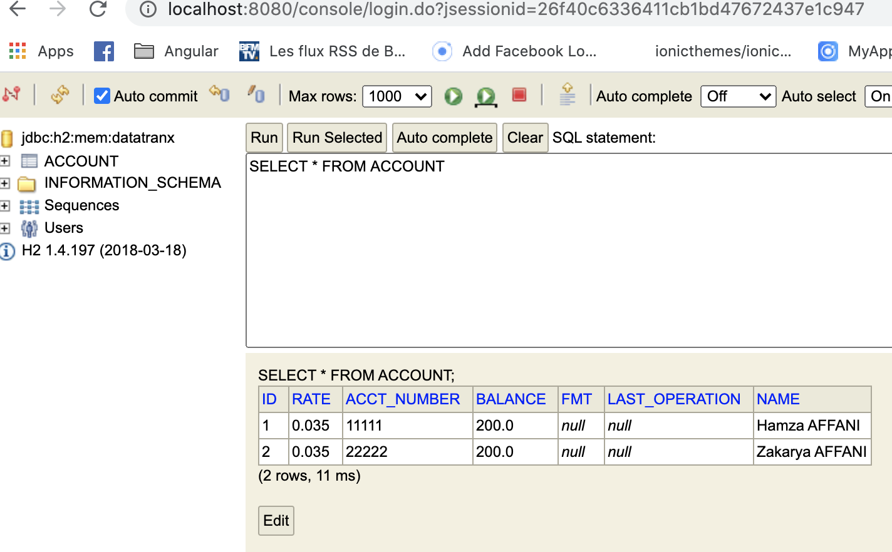

#### Making a POST request via POSTMAN: simulation of a succesful money transfer

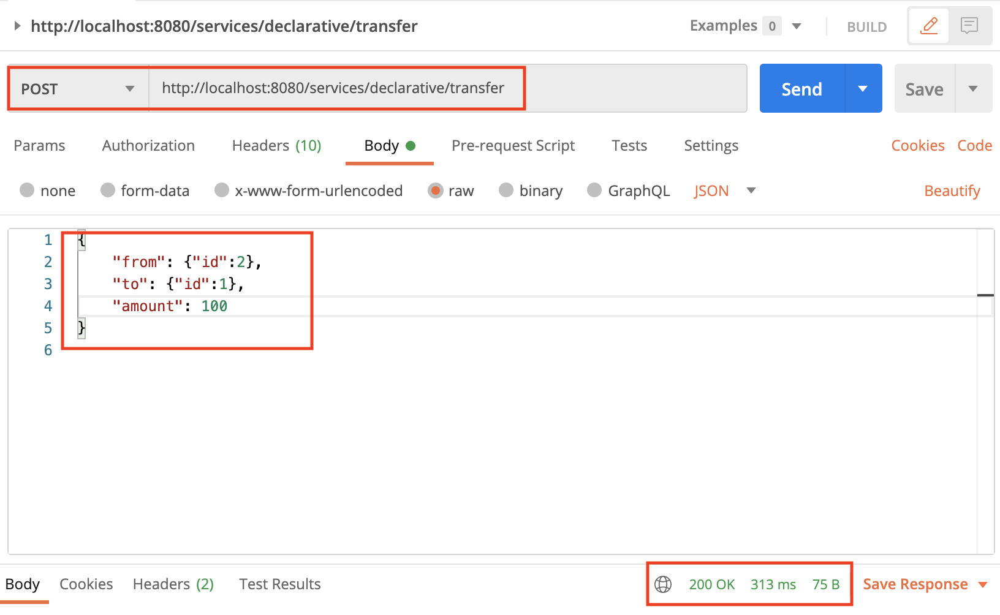

#### Transaction is commited permanently to database

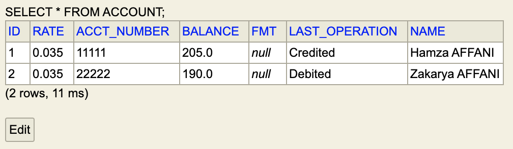

#### Transfer money to an inexistant account: simulation of rollback called when NoSuchElementException is occured

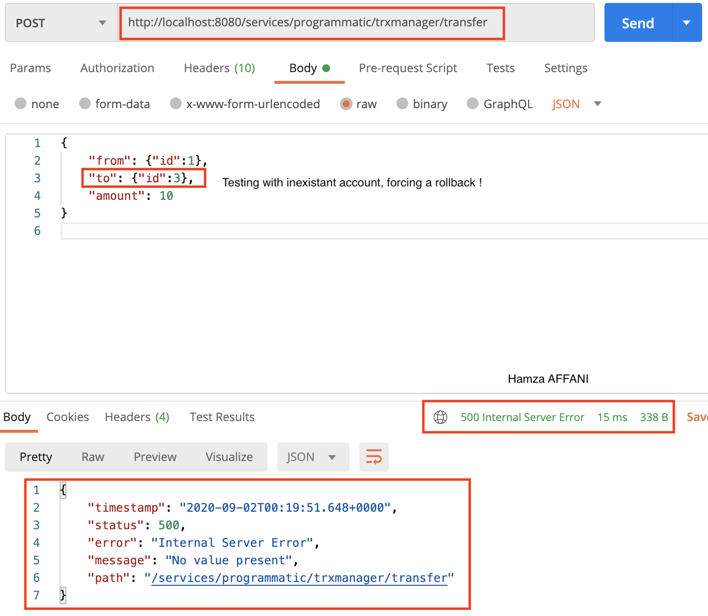

#### NoSuchElementException shown in the console

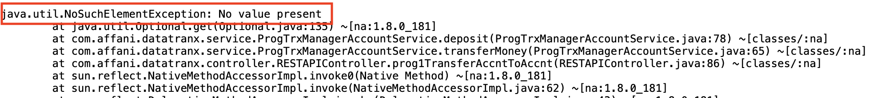

# Conclusion

It's clear now how very important is the transaction management for entreprise applications and how spring ensures data consistency and integrity,

Actually, spring and its various components play an important role in the java ecosystem, this ecosystem enable building scalable backend services and data-intensive apps (SpringBatch).

It's popular, stable, it offers a predictive environment and excellent performance at runtime.

# Bibliography

https://app.pluralsight.com/player?course=data-transactions-spring

https://spring.io/blog/2012/05/23/transactions-caching-and-aop-understanding-proxy-usage-in-spring

https://docs.spring.io/spring-framework/docs/current/javadoc-api/org/springframework/transaction/PlatformTransactionManager.html

https://www.faceprep.in/dbms/dbms-acid-properties/

https://www.tutorialspoint.com/spring/spring_transaction_management.htm
