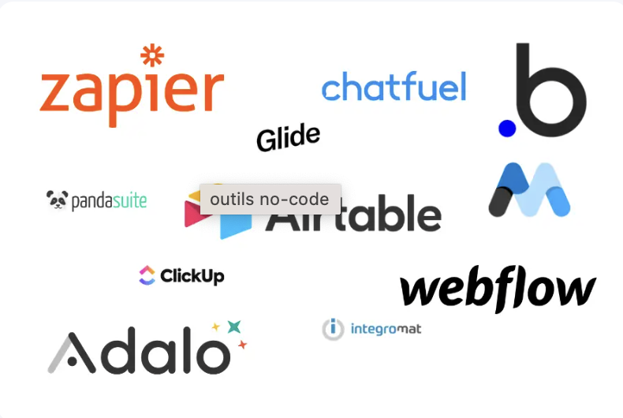
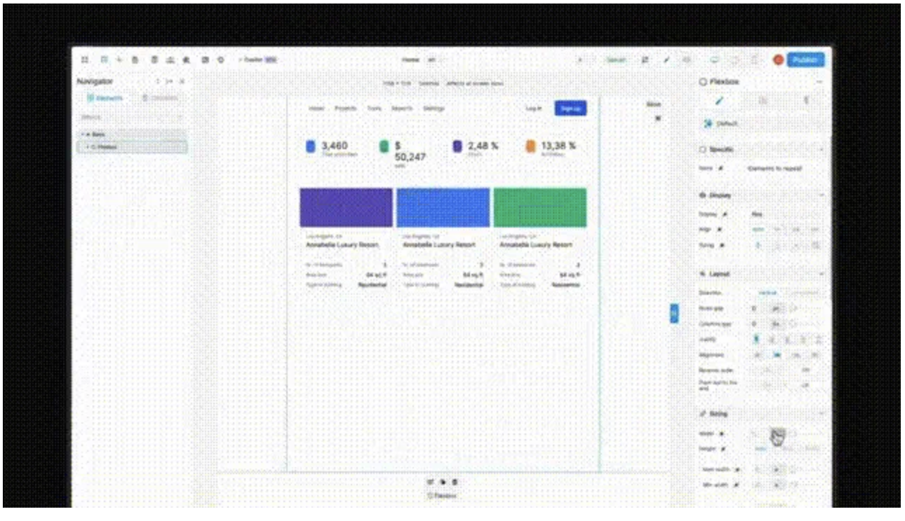
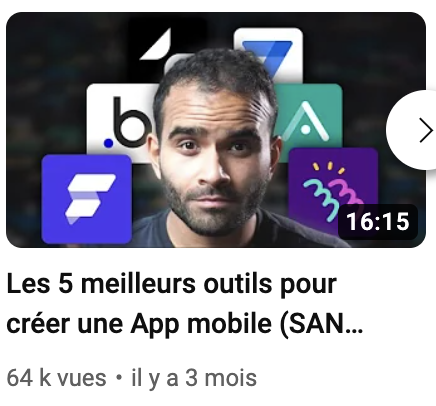
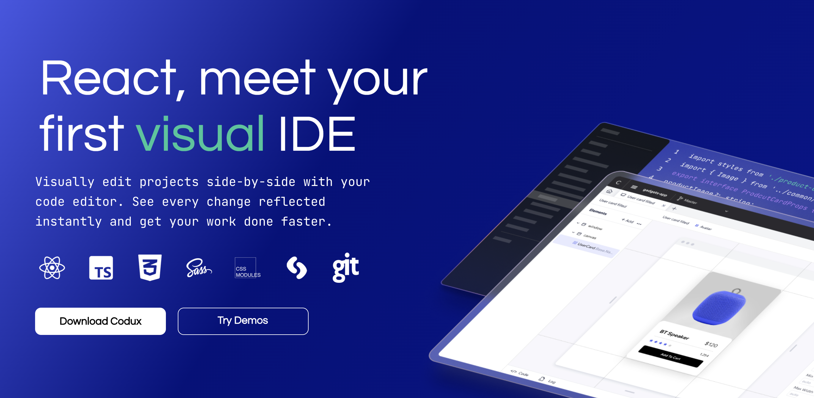
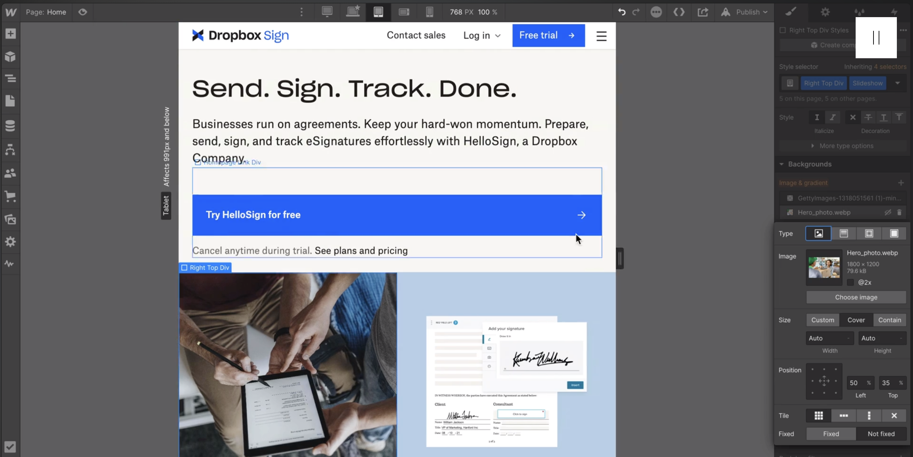
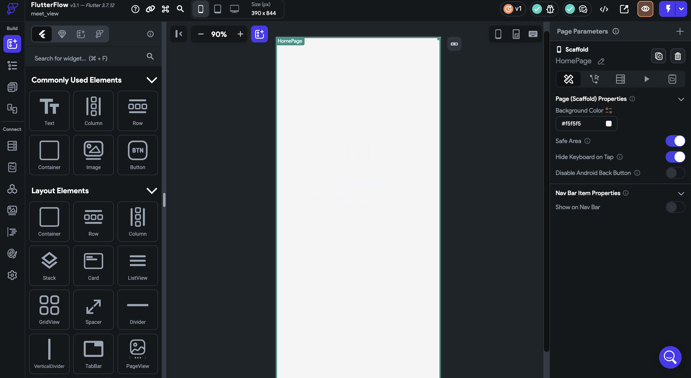

Durant mes deux années de BTS j'ai approfondi ma veille technologie à travers différents sujets. J'ai donc utilisé plusieurs outils pour me permettre de m'organiser dans mes recherches.

### Mes outils

1. [Feedly](https://feedly.com/) est un agrégateur de flux RSS qui permet de suivre les actualités de différents sites web et blogs en un seul endroit. Cela me permet d'ajouter facilement des sources d'information pertinentes sur différents sujets pour recevoir des mises à jour régulières.
2. [Daly.dev](https://daily.dev/), quant à lui, est une plateforme de veille technologique qui propose des newsletters et des briefings quotidiens sur les dernières tendances en matière de développement et de technologies. Je me suis abonné à leur newsletter pour recevoir des mises à jour régulières sur plusieurs sujets.
3. Je suis aussi quelque compte [Twitter](https://twitter.com/) pour m'informer.

### Sur un tas de sujets différents ma veille c'est principalement faite sur le sujet du [no-code](https://quels-outils-nocode.fr/)

# No code

## 1. Présentation

Le no-code est une méthode de développement d'applications qui permet de créer des applications logicielles sans avoir besoin de coder manuellement. Cette approche permet aux personnes sans compétences techniques de créer des applications rapidement et facilement, en utilisant des outils visuels intuitifs.

## 2. Différents outils pour développer

Le no-code utilise des plateformes de développement visuels et des outils qui permettent de construire des applications à l'aide de modèles et de blocs de construction préconçues. Ces outils de développement sont souvent basés sur des interfaces glisser-déposer et des assistants qui guident l'utilisateur tout au long du processus de développement.

Il existe de plus en plus d'outils permettant de développer des services informatiques sans avoir besoin d'écrire une seule ligne de code.

## 3. Les avantages d'utiliser le no-code

L'avantage du no-code est que les utilisateurs peuvent se concentrer sur la création d'une application sans avoir à se soucier des aspects techniques de la programmation, ce qui réduit considérablement le temps et les ressources nécessaires pour développer une application.

En outre, les applications no-code sont souvent plus rapides à développer et moins coûteuses à déployer que les applications traditionnelles, ce qui en fait une option attrayante pour les petites entreprises et les entrepreneurs.

## 4. Mes sources en lien avec le no-code

1. Les sites nocodestation.substack.com et nocodenews.dev sont des newsletters qui offrent des mises à jour régulières sur les dernières tendances et les nouveaux outils dans le domaine du no-code. Ils peuvent être utiles pour rester informé des développements les plus récents.
#### Article (WeWeb prépare son “AI Copilot”)
Ils l’ont annoncé déjà depuis quelques semaines et ont déjà présenté les possibilités, mais WeWeb a pris très sérieusement le sujet de l’IA à son compte.
L’objectif est simple : de permettre de créer le front de tes webapps encore plus rapidement grâce à l’IA.
Bien évidemment, tout cela va se faire via les fameux prompts !
Le dernier point en date que je regarde attentivement, c’est la possibilité de transférer un fichier Figma directement depuis WeWeb.
La démo est ci-dessus.
Pour l’instant, c’est en bêta, mais cette fonctionnalité est nécessairement très attendue de la part de la communauté no-code.

2. La chaîne Youtube "Shubham SHARMA" propose des tutoriels et des vidéos pratiques sur le no-code, qui peuvent vous aider à mieux comprendre comment utiliser les outils de développement no-code.
#### Article (Les 5 meilleurs outils pour créer une App mobile (SANS CODER))
Lien : https://www.youtube.com/watch?v=qBuH7XOpfKw

Comment créer une application mobile sans coder (en NoCode) ? On s'est déjà posé cette question et très vite le choix de l'outil arrive. Est-ce qu'on prend un outil NoCode ou LowCode ? Combien cela va coûter ? Quelles seront les limites ? Est-ce que je fais uniquement mon #mvp ou toute mon application en NoCode.

3. Les articles sur Product Hunt offrent des présentations de nouveaux produits et services dans le domaine du no-code, tels que Bravo Studio, NoCode Chrome Extensions Builder, et FireAPIs. Ces articles peuvent vous donner une idée des nouvelles applications et des nouvelles fonctionnalités qui sont en cours de développement.

Enfin, Softr, une autre plateforme no-code, a récemment inauguré la No-Code House, un espace de travail partagé dédié aux créateurs no-code. La No-Code House offre un lieu de travail collaboratif pour les créateurs no-code, ainsi qu'un programme de formation et de mentorat pour aider les utilisateurs à développer leurs compétences no-code et à lancer leurs propres projets.

Glide, quant à lui, a récemment lancé un programme de formation au format bootcamp pour aider les personnes intéressées par le no-code à acquérir les compétences nécessaires pour devenir des développeurs no-code professionnels. Le programme couvre des sujets tels que la conception de produits, la logique de programmation, la gestion de bases de données et le développement d'applications mobiles.

## 5. Exemple de logiciel que j'ai pu utiliser

1. Le logiciel Codux qui est un outil intéressant qui permet de créer des applications React sans avoir besoin de coder. Cela peut être un excellent outil pour ceux qui cherchent à créer des applications personnalisées sans avoir à apprendre à coder manuellement.

2. Mais aussi le logiciel Webflow qui est un autre outil de développement no-code populaire. Il s'agit d'une plateforme de conception et de développement web visuel qui permet de créer des sites web interactifs et des applications web sans avoir besoin de coder manuellement. De plus il permet d'exporter le code et donc de pouvoir coder seulement sur la partie back-end.

3. Ou encore le logiciel FlutterFlow qui permet de créer des applications mobiles avec la technique Flutter sans coder qui seront disponibles sur Android et IOS.
